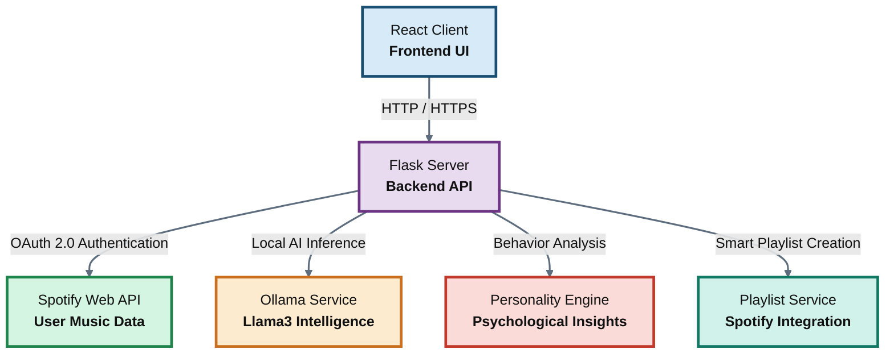

# 🎵 Sonic Persona — AI Music Personality Analyzer

A cinematic Spotify Wrapped-style AI music personality platform that analyzes your Spotify listening history to generate detailed personality insights, mood spectrums, and custom playlists using local AI (Ollama/Llama3).

This application provides users with a comprehensive view of their musical DNA through interactive visualizations, AI-generated personality readings, and personalized music recommendations. Built as a full-stack web application with a modern React frontend and a robust Python Flask backend.

---

## 🏗️ Tech Stack

| Layer          | Technology |
|----------------|------------|
| **Frontend**   | React 18 + Vite, TailwindCSS, Framer Motion, Recharts, html2canvas |
| **Backend**    | Flask (Python), Spotify OAuth 2.0, Flask-CORS, Flask-Session |
| **AI Engine**  | Ollama + Llama3 (local inference) |
| **Authentication** | Spotify OAuth 2.0 with PKCE |
| **Data Visualization** | Recharts for charts, Framer Motion for animations |
| **Deployment** | Vite for frontend build, Gunicorn for backend |

---

## 🏛️ Architecture

The application follows a client-server architecture with modular service layers for scalability and maintainability.



### Architecture Components

- **React Client**: Single-page application handling user interface, authentication flow, and data visualization
- **Flask Server**: RESTful API server managing business logic, external API integrations, and session management
- **Spotify Integration**: Handles OAuth authentication and data retrieval from Spotify Web API
- **AI Service**: Local Ollama integration for generating personalized music personality insights
- **Analysis Engine**: Processes listening data to extract patterns, archetypes, and mood metrics
- **Playlist Service**: Creates and manages Spotify playlists based on user preferences

---

## 🎨 Features

### Core Functionality
- **Secure Spotify Authentication**: OAuth 2.0 flow with PKCE for secure user data access
- **Comprehensive Listening Analysis**: Analyzes top tracks, artists, genres, and audio features
- **AI-Powered Personality Insights**: Llama3 generates unique personality readings including roasts, compliments, and alter egos
- **Interactive Visualizations**: 
  - Mood spectrum radar chart (energy, danceability, acousticness, valence)
  - Genre distribution pie chart
  - Era analysis timeline
  - Top artists gallery

### Personality Analysis
- **8 Listening Archetypes**: AI-matched personality types based on musical preferences
- **Aura & Alter Ego Generation**: Creative AI interpretations of musical identity
- **Night Drive Score**: Fun metric measuring "driving at night" compatibility
- **Chaos Meter**: Quantifies musical unpredictability and variety

### Social Features
- **Share Card Export**: Generate and download PNG images for social sharing
- **Custom Playlist Creation**: Automatically creates Spotify playlists from top tracks
- **Responsive Design**: Optimized for desktop and mobile experiences

---

## ⚡ Quick Start

### Prerequisites

- **Python 3.11+**: Backend runtime environment
- **Node.js 18+**: Frontend build tools
- **Ollama**: Local AI inference (optional, app works with fallbacks)
- **Spotify Developer Account**: For API access

---

### 1. Spotify App Setup

1. Visit [Spotify Developer Dashboard](https://developer.spotify.com/dashboard)
2. Create a new application
3. Configure redirect URI: `http://localhost:5001/auth/callback`
4. Note your **Client ID** and **Client Secret**

---

### 2. Backend Setup

```bash
cd server

# Configure environment variables
cp .env.example .env
# Edit .env with your Spotify credentials and other settings

# Install Python dependencies
pip install -r requirements.txt

# Start the Flask development server
python app.py
```

**Server URL**: http://localhost:5001

---

### 3. AI Setup (Optional)

```bash
# Install Ollama from https://ollama.ai
ollama pull llama3

# Ollama runs on http://localhost:11434
# If Ollama is unavailable, the app uses pre-written contextual insights
```

---

### 4. Frontend Setup

```bash
cd client

# Install Node.js dependencies
npm install

# Start the Vite development server
npm run dev
```

**Client URL**: http://localhost:5173

---

## 📁 Project Structure

```
SonicPersona/
├── client/                          # React Frontend
│   ├── public/                      # Static assets
│   ├── src/
│   │   ├── components/              # Reusable UI components
│   │   │   ├── AnimatedBackground.jsx
│   │   │   ├── AuraCard.jsx
│   │   │   ├── GenreChart.jsx
│   │   │   ├── InsightCards.jsx
│   │   │   ├── MoodSpectrum.jsx
│   │   │   ├── Navbar.jsx
│   │   │   ├── PersonalityCard.jsx
│   │   │   ├── PlaylistButton.jsx
│   │   │   ├── ShareCard.jsx
│   │   │   └── TrackList.jsx
│   │   ├── context/                 # React context providers
│   │   │   └── AuthContext.jsx
│   │   ├── pages/                   # Page components
│   │   │   ├── HomePage.jsx
│   │   │   ├── LoadingPage.jsx
│   │   │   └── ResultsPage.jsx
│   │   ├── App.jsx                  # Main app component
│   │   ├── main.jsx                 # App entry point
│   │   └── index.css                # Global styles
│   ├── package.json
│   ├── vite.config.js
│   ├── tailwind.config.js
│   └── postcss.config.js
│
├── server/                          # Python Flask Backend
│   ├── app.py                       # Flask application entry
│   ├── routes/                      # API route handlers
│   │   ├── __init__.py
│   │   ├── auth.py                  # Spotify OAuth routes
│   │   ├── personality.py           # Personality analysis routes
│   │   ├── playlist.py              # Playlist creation routes
│   │   └── spotify.py               # Spotify data routes
│   ├── services/                    # Business logic services
│   │   ├── __init__.py
│   │   ├── ollama_service.py        # AI inference service
│   │   ├── personality_service.py   # Personality analysis logic
│   │   ├── playlist_service.py      # Playlist management
│   │   └── spotify_service.py       # Spotify API client
│   ├── requirements.txt             # Python dependencies
│   └── .env.example                 # Environment template
│
└── README.md                        # This file
```

---

## 🔧 Environment Variables

Create a `.env` file in the `server/` directory with the following variables:

```env
# Required Spotify Configuration
SPOTIFY_CLIENT_ID=your_spotify_client_id
SPOTIFY_CLIENT_SECRET=your_spotify_client_secret
SPOTIFY_REDIRECT_URI=http://localhost:5001/auth/callback

# Flask Configuration
FLASK_SECRET_KEY=your_secure_random_key
FLASK_ENV=development
PORT=5001

# Frontend Configuration
CLIENT_URL=http://localhost:5173

# AI Configuration (Optional)
OLLAMA_HOST=http://localhost:11434
OLLAMA_MODEL=llama3
```

---

## 🚀 Production Deployment

### Backend Deployment
```bash
cd server
pip install gunicorn
gunicorn app:app -w 4 -b 0.0.0.0:5001
```

### Frontend Deployment
```bash
cd client
npm run build
# Deploy the dist/ folder to a static hosting service (Netlify, Vercel, etc.)
```

### Production Considerations
- Update CORS origins and redirect URIs for your domain
- Enable HTTPS and set `SESSION_COOKIE_SECURE=True`
- Configure proper logging and monitoring
- Use environment-specific configuration files

---

## 🧪 Testing

### Demo Mode
Access `/personality/demo` endpoint for testing without Spotify authentication.

### API Testing
Use tools like Postman or curl to test backend endpoints:
```bash
curl http://localhost:5001/auth/login
```

---

## 🤝 Contributing

1. Fork the repository
2. Create a feature branch (`git checkout -b feature/amazing-feature`)
3. Commit your changes (`git commit -m 'Add amazing feature'`)
4. Push to the branch (`git push origin feature/amazing-feature`)
5. Open a Pull Request

---

## 📄 License

This project is licensed under the MIT License - see the LICENSE file for details.

---

## ⚠️ Notes

- **Ollama Integration**: The AI features are optional. The application gracefully falls back to pre-written insights when Ollama is not available.
- **Session Management**: Uses Flask server-side sessions. Ensure proper secret key configuration for production.
- **Rate Limiting**: Spotify API has rate limits; the application includes basic retry logic.
- **Data Privacy**: User data is processed locally and not stored permanently (except in browser sessions).

---

## 📞 Support

For questions or issues:
- Open an issue on GitHub
- Check the demo mode for testing
- Ensure all prerequisites are properly installed
